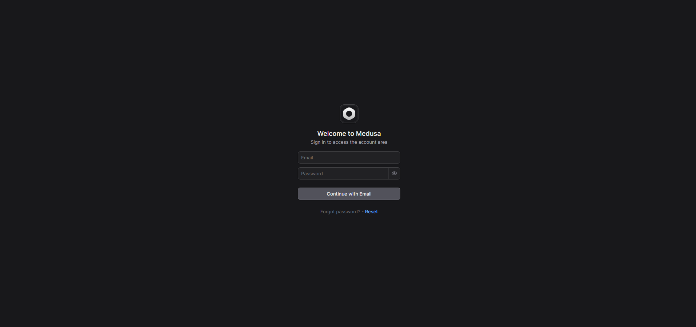
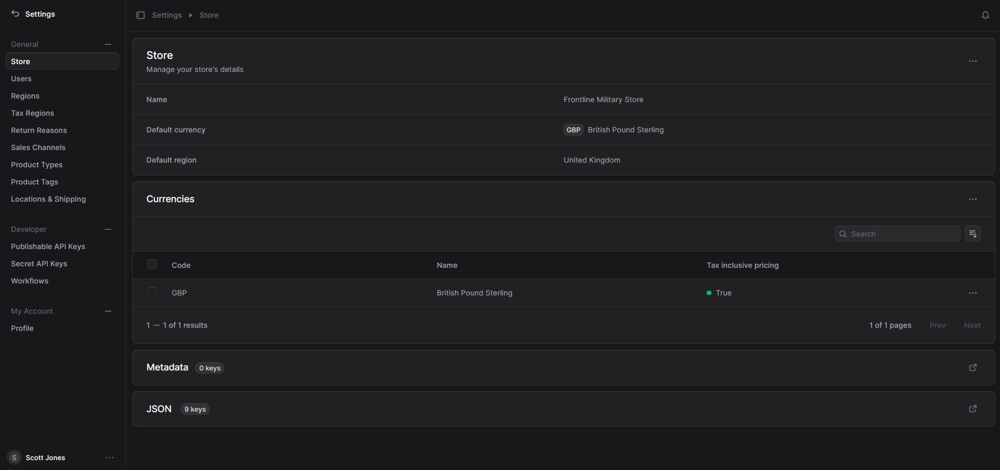

## Accessing the Athena Admin

To get started with Athena, you'll first need to access the admin panel where you can manage your store settings, orders, products, and more.

1. Open your browser and go to the Athena admin URL (e.g., `admin.yourdomain.com`).
2. You'll see the login screen.

### Login to Athena Admin

To log in:

1. Enter your registered email address and password.
2. Click **Login** to access your admin dashboard.

<Accordion>
  <AccordionItem title="Forgot your password?">
    If you forgot your password, click on the "Forgot Password?" link on the login page to reset it.
  </AccordionItem>
</Accordion>

---

## Setting Up Your Store

Once logged in, you can start configuring your store. Follow these steps to get started:

### Step 1: Store Information

Navigate to the **Store Settings** section.

1. Click **Settings** in the left sidebar.
2. Under the **General Settings**, fill in your store’s name, address, and contact information.

### Step 2: Configure Payment Gateways

To accept payments, you need to configure payment methods for your store.

1. In the **Payments** section of the settings, click **Add Payment Method**.
2. Choose the payment provider (e.g., Stripe, PayPal) and follow the instructions to link your account.

### Step 3: Add Products

To start selling, you'll need to add products to your store.

1. Navigate to the **Products** section from the left sidebar.
2. Click **Add New Product**, and fill in the product details like name, price, description, and images.

---

## Admin Features

Once your store is set up, you can manage products, orders, and customer details through the admin interface.

- **Products**: Add, edit, and delete products.
- **Orders**: View and manage customer orders.
- **Customers**: See your customer list and manage customer accounts.

---

## Helpful Tips

<AccordionGroup>
  <Accordion icon="message-bot" title="Accessing Athena Documentation">
    Athena’s full documentation is available for reference. You can access it at any time for more details on how to use the platform effectively.
  </Accordion>
  <Accordion icon="paintbrush" title="Customizing Your Store's Theme">
    Customize the look and feel of your store by modifying the theme in the **Appearance** section of the settings.
  </Accordion>
</AccordionGroup>

---

## Resources

- [How to integrate APIs](./api-integration.md)
- [Setting up your custom domain](./custom-domain.md)
- [Admin User Guide](./admin-guide.md)
